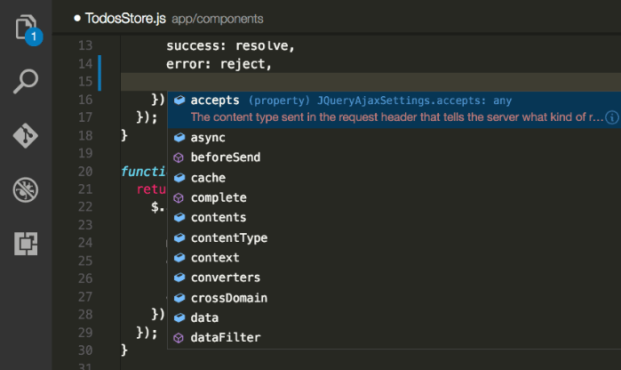
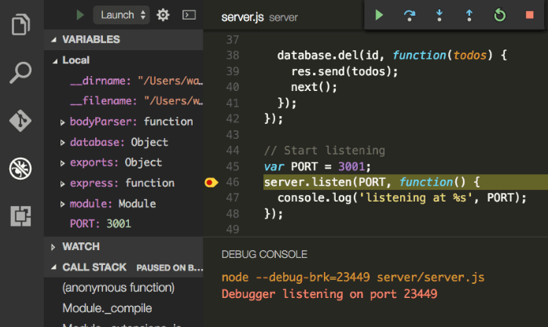
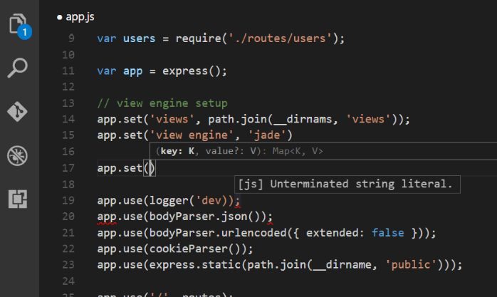
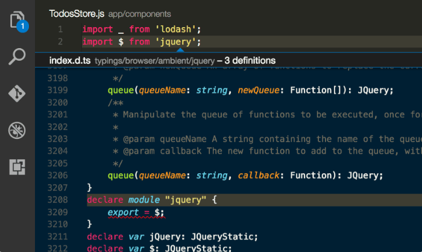
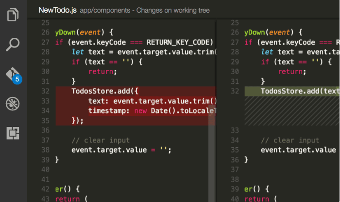

# Visual Studio Code总览

Visual Studio Code是一款强大、轻量的跨平台桌面源代码编辑器，可以运行在Windows，macOS和Linux上。它内置了对JavaScript，TypeScript和Node.js支持，并且具有对其他语言的丰富扩展插件系统和运行时(Runtimes)。

## Visual Studio Code特性

- **智能代码补全**：更智能的对变量、方法和导入模块的代码感知。
- **精简Debug**：打印调试已经是过去式了，现在我们可以用终端工具来进行VS Code Debug。
- **更快更强大的编辑功能**：代码对齐、多光标编辑、参数提示和其他强大的编辑功能。
- **代码导航和重构**：快速浏览你的源代码并导航到定义位置。
- **内置的Git支持**：内置的Git支持加块代码发布。

## 热门插件扩展

扩展能开启对其他编程语言、主题、Debug、命令的支持，Visual Studio Code提高你的工作效率。

- C#
- Python
- Debugger for Chrome
- C/C++
- Go
- ESLint
- PowerShell
- HTML Snippets

## 千里之行，始于足下

想要充分掌握Visual Studio Code，必须要从以下几个基本主题展开

- [安装](https://code.visualstudio.com/Docs/setup/setup-overview)
- [基本操作](https://code.visualstudio.com/Docs/editor/codebasics)
- [设置](https://code.visualstudio.com/Docs/customization/userandworkspace)
- [语言](https://code.visualstudio.com/Docs/languages/overview)
- [Node.js](https://code.visualstudio.com/Docs/runtimes/nodejs)
- [VSCode架构与理念](https://code.visualstudio.com/Docs/editor/whyvscode)

## 下载Visual Studio Code

快速找到适合你的平台的[Visual Studio Code](https://code.visualstudio.com/download)版本。

## 隐私

通常情况下，Visual Studio Code自动更新到最新版本，并收集使用数据和崩溃报告信息，您可以通过以下几个步骤，禁用他们。

- [如何关闭自动更新](https://code.visualstudio.com/Docs/supporting/faq#_how-do-i-opt-out-of-vs-code-autoupdates)
- [如何关闭崩溃报告](https://code.visualstudio.com/Docs/supporting/faq#_how-to-disable-crash-reporting)
- [如何关闭使用报告](https://code.visualstudio.com/Docs/supporting/faq#_how-to-disable-telemetry-reporting)