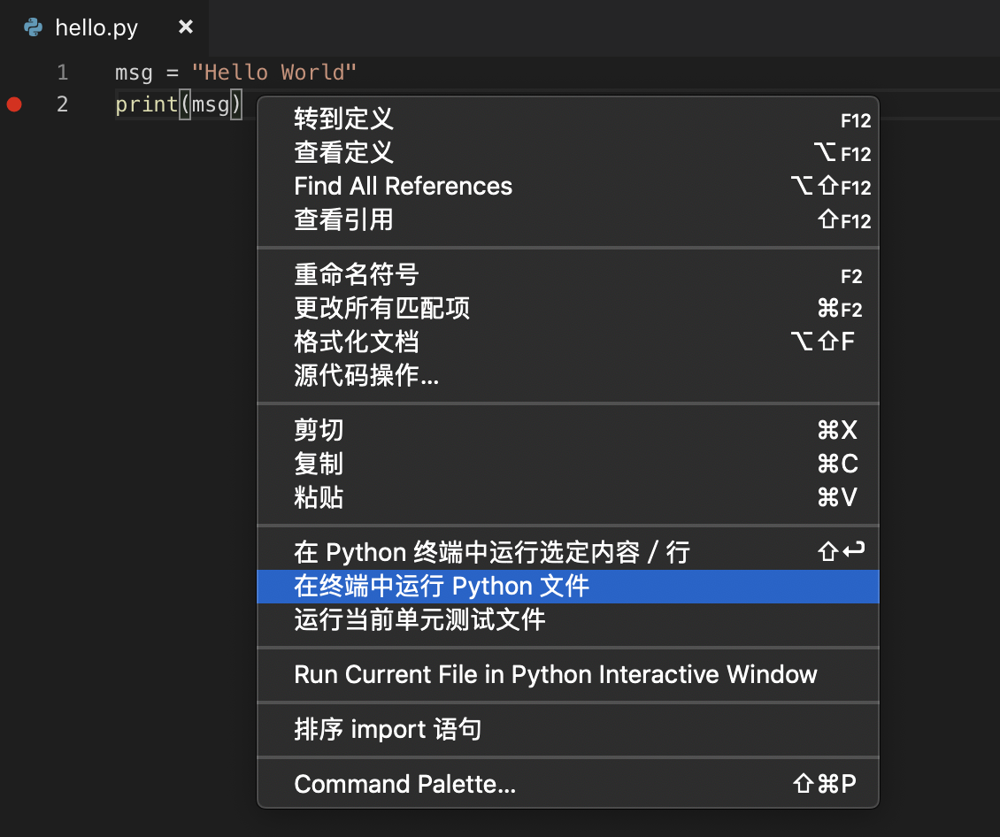

[原文链接](https://code.visualstudio.com/docs/python/python-tutorial)
[TOC]
在这个教程里，你使用 Python 3 在 Visual Studio Code 中创建一个简单的 “Hello World” Python 应用。通过使用 Python 扩展，你可以将 VS Code 变成一个不错的轻量级 Python IDE（你可能会发现这是 PyCharm 之外的一个高效替代选择）。

这个教程目的在于为你介绍将 VS Code 作为 Python 环境，主要是怎么编辑、运行以及调试代码。这个教程不会教你 Python 本身的知识。只要你熟悉了 VS Code 的基础知识，你就能够在 VS Code 提供的语言介绍环境中学习列在 [python.org](https://www.python.org) 上的任何 [编程教程](https://wiki.python.org/moin/BeginnersGuide/Programmers)。

如果你有任何疑问，尽管在 [VS Code documentation respository](https://github.com/Microsoft/vscode-docs/issues) 提问。
>**注意：** 你可以在 VS Code 中使用 Python 2 学习这个教程，但是你需要对代码做一些调整，这个教程中没有涵盖这些内容。

### 前置条件
为了顺利地学习这个教程，需要先满足以下条件：

1. 安装 [VS Code 的 Python 扩展](https://marketplace.visualstudio.com/items?itemName=ms-python.python)。对于安装扩展的细节请查看 [扩展市场](https://code.visualstudio.com/docs/editor/extension-gallery)。所需 Python 扩展名字就叫 **Python**，由微软发布。
2. 安装一个 Python 3 版本（这个教程即为 Python 3 所写）。可选项如下：

    * （所有系统适用）从 [python.org](https://www.python.org) 下载；你可以索性就点击出现在页面前边的 **Download Python 3.7.1** 按钮（或者当前最新版本就行）。
    * （Linux）系统自带安装的 Python 3 就可以，但是如果你想安装其他 Python 程序，那么你必须先通过 [`get-pip.py`](https://pip.pypa.io/en/stable/installing/#installing-with-get-pip-py) 安装 `pip`。
    * （macOS）在 macOS 系统上通过 [Homebrew](https://brew.sh/) 使用 `brew install python3` 命令安装（macOS上系统预装的 Python（Python 2.7）是不支持的）。
    * （所有系统适用）从 [Anaconda](https://www.anaconda.com/download/) 下载（用于数据科学）。
3. 在 Windows 系统上，确保你的 Python 解释器位置（也就是安装在什么路径，比如 `c:\python32`）包含在 PATH 环境变量中。你可以通过在命令行运行 `path` 指令检查安装位置。如果没有包含 Python 解释器所在目录，打开 Windows 设置，检索“environment”，选择**为你的账户编辑环境变量**，然后编辑**Path**变量使包含Python所在目录。
4. 在 MacOS 系统上，确保 PATH 环境变量中包含了 VS Code 安装所在目录。查看 [配置说明](https://code.visualstudio.com/docs/setup/mac#_launching-from-the-command-line) 获取更多信息。

### 在一个项目（工作台）目录中启动 VS Code

在命令行或者终端中输入以下命令，创建一个名为“hello”的空目录，进入此目录，并在该目录（ `.`）中打开 VS Code（ `code`）：
> mkdir hello
> cd hellow
> code .

在一个目录中启动 VS Code，这个目录就会变成你的“工作台”。VS Code 将针对这个工作台的设置存储在 `.vscode/settings.json`，与全局存储的用户设置是隔离开的。
同样，你可以通过操作系统UI启动 VS Code，然后使用 **文件 > 打开目录** 来打开项目目录。

### 选择一个 Python 解释器
Python 是一种解释型语言，为了运行 Python 代码及获得智能提示，你必须告诉 VS Code 使用哪个解释器。
在 VS Code 内，通过打开 **命令面板**（⇧⌘P），输入 **Python: 选择解释器** 来检索，然后选择对应命令。如果可用的话，你也可以使用状态栏上的 **选择Python环境** 选项，（也可能状态栏已经显示了一个已选的解释器）：


命令板会自动展示 VS Code 能够找到的可用解释器列表，包括虚拟环境。如果你没有找到期望的解释器，参考一下 [配置 Python 环境](https://code.visualstudio.com/docs/python/environments)。

选择一个解释器会将你的工作台中的 `python.pythonPath`值设置为该解释器路径。想要查看设置，选择 **文件 > 首选项 > 设置**(在 macOS 系统上为**Code > 首选项 > 设置**)，然后选择 **工作台** 页签。
> **注意：** 如果你在没有打开任何工作台的情况下选择了一个解释器，VS Code 会转而设置你的用户设置中的 `python.pthonPath`值，这样会全局设置 VS Code 默认解释器。这里的用户设置可以确保你总是有一个默认的 Python 项目解释器。工作台设置可以让你覆盖用户设置。

### 创建一个 Python Hello World 源代码文件
在文件浏览工具栏中，点击 `hello`目录上的 新建文件按钮：


命名为 `hello.py`，这个文件会在编辑器中自动打开：


通过使用 `.py`文件后缀，你告知 VS Code 将这个文件解释为一个 Python 程序，以便 VS Code 使用 Python 扩展及所选择的解释器分析所含内容。

接下来，开始输入以下源代码（如果使用 Python 3）：
``` python
msg = "Hello World"
print(msg)
```
当你开始输入 `print`，注意 [智能提示](https://code.visualstudio.com/docs/editor/intellisense) 是如何提示自动补全选项的。


智能提示和自动补全适用于标准 Python 模块以及安装到所选 Python 解释器环境里的其他软件包。同样的，它会为对象类型提供可用的方法补全。举个例子，因为 `msg`变量包含一个字符串，当你输入 `msg.` 的时候智能提示会提供字符串方法：


尽情地体验一下智能提示，然后撤销修改使只保留 `msg`变量及调用 `print`方法，再保存这个文件（⌘S）。

想要完整的了解关于编辑、格式化、以及重构，请查看 [代码编辑](https://code.visualstudio.com/docs/python/editing) 章节。Python 扩展同样全面支持 [代码分析 Linting](https://code.visualstudio.com/docs/python/linting)。

### 运行 Hello World


使用 Python 运行 `hello.py`很简单。在编辑器中单击右键然后选择 **在终端中运行Python文件**（也会自动保存文件）：


这个操作会打开终端面板并自动激活你的 Python 解释器，然后运行 `python3 hello.py`(macOS/Linux) 或者 `python hello.py`(Windows)：

你还可以使用另外两种方式在 VS Code 中运行 Python：

* 选中一行或多行，然后按 `Shift+Enter` 组合键或者点击右键并选择 **在Python终端中运行选中内容/行**。这个命令对于测试文件的一部分很方便。
* 使用 **Python: Start REPL**（REPL 即：Read, Eval, Print, Loop, 参考[Python 交互窗口](https://docs.microsoft.com/zh-cn/visualstudio/python/python-interactive-repl-in-visual-studio?view=vs-2019)） 命令为当前选中的 Python 解释器打开一个 REPL 终端，然后你就可以一次输入并运行几行代码。

### 配置及运行调试器
让我们现在尝试一下调试简单的 Hello World 程序。
首先，通过将光标放在 `print`调用处并按下 F9 在 `hello.py`中第2行设置一个断点。或者就点击一下编辑器中的左边槽，在行号旁边。当你设置了断点后，边槽中会出现一个红色圆圈。

接下来，选择边栏上的调试视图：

然后选择调试工具栏上的配置图标（或者使用 **调试 > 打开配置 菜单命名**）：

稍等一会儿，这个命令会创建一个 `launch.json`文件，包含一系列配置项并出现在下拉选项中：

**注意：** VS Code 对于各种配置项都使用 JSON 文件；`launch.json` 就是一个包含调试配置项文件的标准名称。

这些不同的配置项都在 [调试配置项](https://code.visualstudio.com/docs/python/debugging) 中有完整的解释；当前而言，只用选中 **Python：当前文件（集成终端）**，这个配置项会使用当前选择的 Python 解释器运行编辑器当前显示的文件。
>
>**警告**：由于[目前调试器中的一个bug](https://github.com/Microsoft/vscode-python/issues/4223)，接下来关于 `stopOnEntry` 设置的论述不起作用并会引发调试器启动失败。替代方案是在第一行设置一个断点并且**不要**将 `stopOnEntry` 添加到配置中。
>影响段落：
>当程序启动时为了在第一行自动中断调试器，在 `launch.json` 中 "Python: 当前文件"配置下添加一个 `"stopOnEnty": true` 设置，整个配置大致如下：
>``` json
>{
>    "name": "Python: Current File (Integrated Terminal)",
>    "type": "python",
>    "request": "launch",
>    "program": "${file}",
>    "console": "integratedTerminal",
>    "stopOnEntry": true
>},
>```
>改完后保存 `launch.json`。

>**提示：** 如果你需要指定包含调试所用解释器的确切目录，就在配置中囊括一个 `pythonPath` 入口，例如 `"pythonPath": "${workspaceFolder}"` 或 `"pythonPath": "${workspaceFolder}/.venv"`。

>**提示：** 想为 Python 程序指定命令行参数，在配置中添加一行 `"args": []`，然后把各个参数作为元素放在 `[]`列表中，参考 [调试 - 参数]（（/docs/python/debugging#_args）。

切换到编辑器中的 `hello.py`，然后通过选择调试工具栏上的箭头或者按下 F5 来运行调试器。调试器在文件第一行上的断点暂停（如果 `stopOnEntry`设置为 ture 的话则会直接停在第一行）。当前所在行在左侧会有一个黄色箭头标识出来。如果你停在第一行并在这个时候检查 **Local** 变量面板，你会看到只有自动化的双下划线变量被定义了：


一个调试工具栏会出现在顶部，从左至右依次是以下命令：继续/continue（F5），单步跳过/step over（F10），单步调试/step into（F11），单步跳出/step out（⇧F11），重启/restart（⇧⌘F5），以及 停止/stop（⇧F5）。


状态栏也会改变颜色（大多数主题中会是橙色）以标识出你正处于调试模式。**Python 调试控制台**也同样会自动出现在右侧面板下部，用以展示正在执行的命令及程序输出。

想要继续运行程序，选择调试工具栏上的继续命令（F5）。调试器会运行程序直到下一个断点。刚刚定义的 `msg`变量会出现在 **Local**面板中：


你可以在**调试控制台**中使用变量（如果你没有看到，就在 VS Code 右下方区域中选择**调试控制台**，或者..从菜单中选择。）然后试着在 控制台底部的 > 提示处一行一行的输入以下代码：
```
msg
msg.capitalize()
msg.split()
```

再次选择工具栏上的蓝色继续按钮（或者按下 F5 ）运行程序至结束。
如果你切换回 **Python调试控制台**，“Hello World” 会出现在里面，一旦程序执行完成，VS Code 就会退出调试模式。

如果你重启调试器，调试器将再次停在第一个断点（如果 `stopOnEntry`设置为 true，则会停在第一行，在这种情况下调试器停在任何代码运行之前）。

想要在程序执行完成前停止，可以使用调试工具栏上的红色方形停止按钮（⇧F5），或者使用 **调试 > 停止调试** 菜单命令。
查看[调试配置项](https://code.visualstudio.com/docs/python/debugging)以了解完整详情信息，其中包含了关于使用指定 Python解释器 来调试的说明。
> **提示：使用日志点替代 print 表达式：** 开发者经常使用 `print`表达式快速检查变量，而不必在调试器中逐行检查代码。在 VS Code 中，你可以转而使用 **日志点**。一个日志点就像一个断点，它打印信息到控制台中而不暂停程序。了解更多信息，查看 VS Code 调试文章中的[日志点](https://code.visualstudio.com/docs/editor/debugging#_logpoints)。

### Troubleshooting
如果出于某些原因 VS Code 没有为你生成 `launch.json`，你可以在项目目录中创建 `.vscode/launch.json`文件（如果需要的话，创建 `.vscode`目录），然后将以下内容粘贴到 `launch.json`：
``` json
{
    "version": "0.2.0",
    "configurations": [
        {
            "name": "Python: Current File (Integrated Terminal)",
            "type": "python",
            "request": "launch",
            "program": "${file}",
            "console": "integratedTerminal"
        }
    ]
}
```
如果你看到如下"SyntaxError: invalid syntax"（语法错误：无效语法），可能是你尝试过当 `launch.json`展示在编辑器中时启动调试。这个错误之所以出现是因为 `launch.json`并不是像 `hello.py`一样的 Python 代码：
```
    // Use IntelliSense to learn about possible attributes.
     ^
SyntaxError: invalid syntax
```
选中 `hello.py`后再试一下即可。也可以通过在 `launch.json`中的配置列表中添加以下几行来为 `hello.py`文件专门创建一个调试配置。然后在调试器下拉选项中选择这个配置并重新开始调试。
``` json
{
    "name": "Python: hello.py",
    "type": "python",
    "request": "launch",
    "program": "${workspaceFolder}/hello.py",
    "console": "integratedTerminal"
},
```

如果你看到这个消息 - “未找到Python解释器，由于 python.exe 不在工作区目录下，” 或者 “你需要在开始调试前安装一个 Python 解释器，” 那么可能是你的 `launch.json`文件中有 `pythonPython: ${workspaceFolder}`但实际上你的 Python 解释器在另一个路径下。检查一下值，或者完全移除 `pythonPath`属性。

### 安装及使用软件包
现在我们来运行一个有点意思的例子。在 Python 中，软件包是你获得任意有用代码库的方式，通常是从 [PyPI](https://pypi.org/) 获取。举个例子，你使用 `matplotlib`及 `numpy`软件包来创建图形绘制，通用用于数据科学。（注意，由于缺乏必须的UI支持，当运行在 [Windows Subsystem for Linux](https://docs.microsoft.com/windows/wsl/about) 中时 `maptplotlib`不能展示图形。）

回到**浏览**视图（左侧最顶部的图标，用于展示文件），创建一个名为 `standardplot.py`的新文件，粘贴以下源代码：
``` python
import matplotlib.pyplot as plt
import numpy as np

x = np.linspace(0, 20, 100)  # Create a list of evenly-spaced numbers over the range
plt.plot(x, np.sin(x))       # Plot the sine of each x point
plt.show()                   # Display the plot
```
> **提示：** 如果你手动输入上面的代码，可能会发现当你在行末按下回车时自动补全功能会改变 `as`关键字后的名字。如果想避免这种情况，输入一个空格后再按回车。

接下来，试着使用上一节描述的 "Python: Current file" 配置项在调试器中运行这个文件。（如果你还将 `"stopOnEntry": ture`保留在那个配置中，需要再一次选择运行命令以继续。）

除非你正在使用 [Anaconda](https://zh.wikipedia.org/wiki/Anaconda_(Python%E5%8F%91%E8%A1%8C%E7%89%88)) 发行版或者之前已经安装过 `matplotlib`软件包，你应该会看到这条消息：“ModuleNotFoundError: No module named 'matplotlib'”。这样一条信息说明所需的软件包在你的系统上不可用。

为了安装 `matplotlib`软件包（也会安装 `numpy`作为依赖），停止调试器并使用命令面板运行 **终端：新建集成终端(⌃⇧`)**。这个命令会打开所选解释器的命令提示符。然后根据你的操作系统输入以下命名：
> **注意：** 如果 Python 解释器安装在文件系统受保护区域中，则以下命令可能需要请求授权；如果你没有所使用电脑的管理员权限，可能不允许安装软件包。在这种情况下，你需要转而使用*虚拟环境*（查看[Environments](https://code.visualstudio.com/docs/python/environments#_global-virtual-and-conda-environments)）。如果你不能安装软件包或者遇到其他问题，[请在GitHub上开一个issue](https://github.com/Microsoft/vscode-docs/issues) 以便我们协助你调查。
```
# 不要使用 Anaconda 发型版本，因为他们已经包含了 matplotlib 库。

# macOS
sudo python3 -m pip install matplotlib

# Windows (may require elevation)
python -m pip install matplotlib

# Linux (Debian)
sudo apt-get install python3-tk
python3 -m pip install matplotlib
```
现在返回程序中（开启或不开启调试器都行）稍等片刻，一个带有输出的绘图窗口将会出现：


### 使用虚拟环境

Python 开发者最佳实践是避免将软件包安装到全局解释器环境中，就像我们上一节所做的。你应该使用一个包含全局解释器副本的特定项目的虚拟环境。激活该环境后，你之后安装的任何软件包都与其他环境隔离。这种隔离可以减少很多由软件包版本冲突带来的问题。

对于创建及激活虚拟环境、安装软件包的示例，请查看 [Django 教程](https://code.visualstudio.com/docs/python/tutorial-django) 和[Flask 教程](https://code.visualstudio.com/docs/python/tutorial-flask)。

### 下一步

你可以配置 VS Code 以使用已安装的任意 Python 环境，包括虚拟环境和 [conda](https://en.wikipedia.org/wiki/Conda_(package_manager)) 环境。你同样可以使用一个单独的环境来调试。更多详情请查看 [Environments](https://code.visualstudio.com/docs/python/environments)。

要学习更多 Python 语言知识，请在 VS Code 环境下参考列在 [python.org](http://python.org/) 上的任意 [编程教程](https://wiki.python.org/moin/BeginnersGuide/Programmers)。

要学习使用 Django 和 Flask 框架构建 web 应用，请参考以下教程：

* [在 Visual Studio Code 中使用 Django](https://code.visualstudio.com/docs/python/tutorial-django)
* [在 Visual Studio Code 中使用 Flask](https://code.visualstudio.com/docs/python/tutorial-flask)

这里还有更多在 Visual Studio Code 中探索使用 Python 的内容：

* [代码编辑](https://code.visualstudio.com/docs/python/editing) - 学习自动补全，智能提示，格式化，以及重构。
* [代码分析](https://code.visualstudio.com/docs/python/linting) - 启用，配置和应用一系列 Python 代码分析。
* [调试](https://code.visualstudio.com/docs/python/debugging) - 学习本地和远程调试 Python。
* [单元测试](https://code.visualstudio.com/docs/python/unit-testing) - 配置单元测试环境并发现、运行和调试测试。
* [设置参考](https://code.visualstudio.com/docs/python/settings-reference) - 探索 VS Code 中所有 Python 相关设置。
* [使用容器将 Python 部署到 Azure App Service](https://code.visualstudio.com/docs/python/tutorial-deploy-containers)
* [在 Linux 上将 Python 部署到 Azure App Service（预览版）](https://code.visualstudio.com/docs/python/tutorial-deploy-app-service-on-linux)