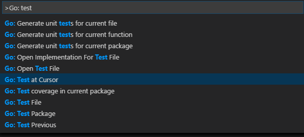

# 在Visual Studio Code中使用Go   Go in Visual Studio Code

Using the Go extension for Visual Studio Code, you get language features like IntelliSense, code navigation, symbol search, bracket matching, snippets, and many more that will help you in [Golang](https://golang.org/) development.  

使用Visual Studio Code上的Go扩展，你可以得到[Golang](https://golang.org/)语言特性支持，例如智能提示，代码导航，符号查找，括号匹配，代码片段等。


You can install the Go extension from the VS Code [Marketplace](https://marketplace.visualstudio.com/items?itemName=ms-vscode.Go).  

你可以从VS Code [Marketplace](https://marketplace.visualstudio.com/items?itemName=ms-vscode.Go)安装Go扩展。

## 智能提示   IntelliSense 

### 自动补全  Auto completions 

As you type in a Go file, you can see IntelliSense providing you with suggested completions. This even works for members in current, imported, and not yet imported packages. Just type any package name followed by `.`, and you will get suggestions for the corresponding package members.  

当你编写go文件时，你可以看见带有建议补全的智能提示。这甚至适用于当前，已导入和尚未导入的程序包中的成员。 只需键入任何软件包名称，然后输入`.`，您将获得有关相应软件包成员的建议。

By setting `go.autocompleteUnimportedPackages` to `true` in your [settings](/docs/getstarted/settings.md), you can also get suggestion for packages that you could import. Select one of these suggestions and an import to the selected package will be added to your file.  

在你的 [settings](/docs/getstarted/settings.md)中设置`go.autocompleteUnimportedPackages` 为 `true`，你将只得到已导入包的建议

>**Tip**: Use `kb(editor.action.triggerSuggest)` to trigger the suggestions manually.  

>**Tip**: 用 `kb(editor.action.triggerSuggest)` 来手动触发建议.  


### 悬浮信息  Hover Information

Hovering on any variable, function, or struct will give you information on that item such as documentation, signature, etc.  

在任何变量，函数或者结构体上悬浮，可以提供对应的信息，例如注释，参数等等。


By default, the extension uses `godef` and `godoc` to get this information. You can choose to use `gogetdoc` instead by changing the setting `go.docsTool` in your User or Workspace Settings.  

默认情况，扩展使用`godef` 和 `godoc`获取这些信息。你可以选择使用`gogetdoc`代替。设置方法：改变用户设置或工作空间设置中的`go.docsTool`。

### Signature help

When you open the `(` while calling a function, a pop-up provides signature help for the function. As you keep typing the parameters, the hint (underline) moves to the next parameter.  

当你调用函数时，打出`(`，一个弹窗为函数提供参数帮助。当你输入一些参数，提示（下划线）移动到下一个参数。


>**Tip**: Use `kb(editor.action.triggerParameterHints)` to manually trigger the signature help when the cursor is inside the `()` in the function call.  

>**Tip**: 当光标在函数调用的`()`之内，用 `kb(editor.action.triggerParameterHints)` 去手动触发参数帮助。

The extension's signature help also uses `godef` and `godoc`. You can choose to use `gogetdoc` instead by changing the setting `go.docsTool` in your User or Workspace Settings.    

扩展的参数帮助也使用 `godef` 和 `godoc`。你可以选择使用`gogetdoc`代替。设置方法：改变用户设置或工作空间设置中的`go.docsTool`。

## 代码导航  Code navigation

Code navigation features are available in the context menu in the editor.  

代码导航特性适用于编辑器中的文本菜单。

- **Go To Definition** `kb(editor.action.revealDefinition)` - Go to the source code of the type definition.
- **Peek Definition** `kb(editor.action.peekDefinition)` - Bring up a Peek window with the type definition.
- **Go to References** `kb(editor.action.goToReferences)` - Show all references for the type.


You can navigate via symbol search using the **Go to Symbol** commands from the **Command Palette** (`kb(workbench.action.showCommands)`).

- Go to Symbol in File - `kb(workbench.action.gotoSymbol)`
- Go to Symbol in Workspace - `kb(workbench.action.showAllSymbols)`

You can also navigate back and forth between a Go file and its test implementation using the **Go: Toggle Test File** command.

## Build, lint, and vet

On save, the Go extension can run `go build`, `go vet`, and your choice of linting tool (`golint` or `gometalinter`) on the package of the current file. You can control these features via the settings below:

- `go.buildOnSave`
- `go.buildFlags`
- `go.vetOnSave`
- `go.vetFlags`
- `go.lintOnSave`
- `go.lintFlags`
- `go.lintTool`
- `go.testOnSave`

The errors and warnings from running any/all of the above will be shown red/green squiggly lines in the editor. These diagnostics also show up in the **Problems** panel  (**View** > **Problems**).

## Formatting

You can format your Go file using `kb(editor.action.formatDocument)` or by running the **Format Document** command from the **Command Palette** or the context menu in the editor.

By default, formatting is run when you save your Go file. You can disable this behavior by setting `editor.formatOnSave` to `false` for the [Go] language. You can change this using your json setting files

```json
"[go]":  {
        "editor.formatOnSave": false
    }
```

You can choose among three formatting tools: `gofmt`, `goreturns`, and `goimports` by changing the setting `go.formatTool`.

## Test

There are many test-related commands that you can explore by typing "Go: test" in the **Command Palette**.



The first three above can be used to generate test skeletons for the functions in the current package, file or at cursor using `gotests`. The last few can be used to run tests in the current package, file or at cursor using `go test`. There is also a command for getting test coverage.

## Import packages

Run the command **Go: Add Import** to get a list of packages that can be imported to your Go file. Choose one and it will get added in the import block of your Go file.

## Rename symbols

You can rename symbols using `kb(editor.action.rename)` or by running the **Rename Symbol** command in the context menu in the editor.

## Debugging

The Go extension lets you debug Go code as well. You will need to install the [Delve](https://github.com/derekparker/delve) debugger manually as a prerequisite. Read [Debugging Go code using VS Code](https://github.com/Microsoft/vscode-go/wiki/Debugging-Go-code-using-VS-Code) for setup steps, information on remote debugging and a troubleshooting guide.

## Next steps

This has been a brief overview showing the Go extension features within VS Code. For more information, see the details provided in the Go extension [README](https://marketplace.visualstudio.com/items?itemName=ms-vscode.Go).

To stay up-to-date on the latest features/bug fixes for the Go extension, see the [CHANGELOG](https://github.com/Microsoft/vscode-go/blob/master/CHANGELOG.md).

If you have any issues or feature requests, feel free to log them in the Go extension [repo](https://github.com/Microsoft/vscode-go/issues).

If you'd like to learn more about VS Code, try these topics:

* [Basic Editing](/docs/editor/codebasics.md) - A quick introduction to the basics of the VS Code editor.
* [Install an Extension](/docs/editor/extension-gallery.md) - Learn about other extensions are available in the [Marketplace](https://marketplace.visualstudio.com/vscode).
* [Code Navigation](/docs/editor/editingevolved.md) - Move quickly through your source code.
