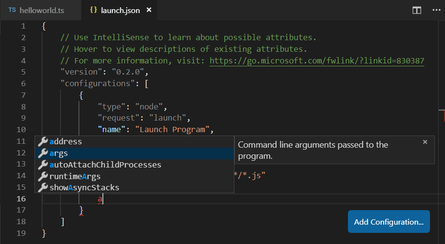
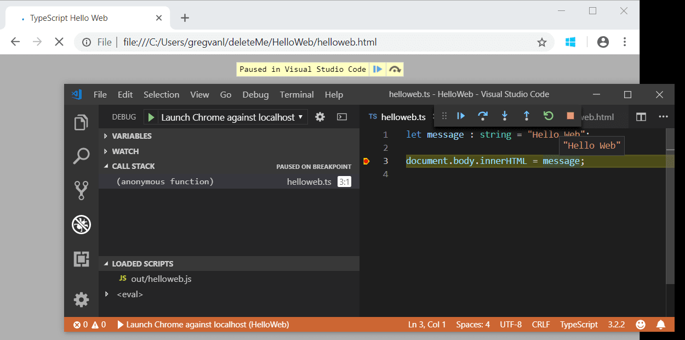

# Debugging TypeScript
# 调试 Typescript

Visual Studio Code supports TypeScript debugging through its built-in [Node.js debugger](/docs/nodejs/nodejs-debugging.md) and [Edge and Chrome debugger](/docs/nodejs/browser-debugging.md).

Visual Studio Code支持ts调试，通过它内置的[Node.js debugger](/docs/nodejs/nodejs-debugging.md) 和 [Edge and Chrome debugger](/docs/nodejs/browser-debugging.md).


## JavaScript source map support
## JavaScript source map 支持

TypeScript debugging supports JavaScript source maps. To generate source maps for your TypeScript files, compile with the `--sourcemap` option or set the `sourceMap` property in the `tsconfig.json` file to `true`.

TypeScript调试支持js source maps。为了将你的ts文件生成source map，执行编译的时候输入`--sourcemap`选项或者把`tsconfig.json`文件里的`sourceMap`属性设置为`true`即可。

In-lined source maps (a source map where the content is stored as a data URL instead of a separate file) are also supported, although in-lined source is not yet supported.

行内source maps（一种source map将内容作为data URL存储在行内而不是单独的文件中）也是被支持的，即使行内source还没有被支持。

For a simple example of source maps in action, see the [TypeScript tutorial](/docs/typescript/typescript-tutorial.md), which shows debugging a simple "Hello World" Node.js application using the following `tsconfig.json` and VS Code default Node.js debugging configuration.

如果想看在用的source map的例子，请查看这个[TypeScript tutorial](/docs/typescript/typescript-tutorial.md)例子，它展示了如何调试一个"Hello World"的Nodejs应用，使用的是下面的`tsconfig.json`配置和Vscode默认的Node.js调试配置。

```json
{
    "compilerOptions": {
        "target": "es5",
        "module": "commonjs",
        "outDir": "out",
        "sourceMap": true
    }
}
```

For more advanced debugging scenarios, you can create your own debug configuration `launch.json` file. To see the default configuration, go to the **Run and Debug** view (`kb(workbench.view.debug)`) and select the **create a launch.json file** link.

对于更高级的调试场景，你可以创建自己的`launch.json`配置文件。想查看其默认配置，去 vscode **Run and Debug** 界面 (`kb(workbench.view.debug)`) 然后点击 **create a launch.json file** 链接.

This will create a `launch.json` file in a `.vscode` folder with default values detected in your project.

它会在`.vscode`文件夹下创建一个`launch.json`文件，包含一个检测到您的项目的默认配置。

```json
{
    // Use IntelliSense to learn about possible attributes.
    // Hover to view descriptions of existing attributes.
    // For more information, visit: https://go.microsoft.com/fwlink/?linkid=830387
    "version": "0.2.0",
    "configurations": [
        {
            "type": "node",
            "request": "launch",
            "name": "Launch Program",
            "program": "${workspaceFolder}/helloworld.ts",
            "preLaunchTask": "tsc: build - tsconfig.json",
            "outFiles": [
                "${workspaceFolder}/out/**/*.js"
            ]
        }
    ]
}
```

VS Code has determined the program to launch, `helloworld.ts`, included the build as a `preLaunchTask`, and told the debugger where to find the generated JavaScript files.

VSCode已经确定要启动的程序---`helloworld.ts`，将构建操作作为 `preLaunchTask` 包含在内，并告诉调试器在哪里可以找到生成的 JavaScript 文件。

There is full IntelliSense with suggestions and information for `launch.json` to help you learn about other debug configuration options. You can also add new debug configurations to `launch.json` with the **Add Configuration** button in the lower right.

这里有智能化的建议和信息帮助你配置`launch.json`并学习其他调试配置选项。你也可以点击右下方的**Add Configuratio...**按钮新增配置选项到`launch.json`文件。



Also see [Node.js Debugging](/docs/nodejs/nodejs-debugging.md) for examples and further explanations.

也可以在[Node.js Debugging](/docs/nodejs/nodejs-debugging.md)中的查看案例和进一步的解释。

## Mapping the output location
## 映射到输出位置

If generated (transpiled) JavaScript files do not live next to their source, you can help the VS Code debugger locate them by setting the `outFiles` attribute in the launch configuration. Whenever you set a breakpoint in the original source, VS Code tries to find the generated source by searching the files specified by glob patterns in `outFiles`.

如果生成的（转译的）js文件不在它们源文件旁边，你可以通过设置launch配置文件中`outFiles`属性帮助VSCode 调试器定位到它们具体的位置。每当你在源码中设置了一个断点，VSCode就会通过`outFiles`的二进制匹配的方式定位到生成的source文件。

## Client-side debugging
## 客户端调试

TypeScript is great for writing client-side code as well as Node.js applications and you can debug client-side source code with the [built-in Edge and Chrome debugger](/docs/nodejs/browser-debugging.md).

TypeScript 非常适合编写客户端代码以及 Node.js 应用程序，你可以用[built-in Edge and Chrome debugger](/docs/nodejs/browser-debugging.md)调试客服端侧的源码。

We'll create a tiny web application to show client-side debugging in action.

我们创建了一个小的web应用去展示如何调试端侧的代码。

Create a new folder `HelloWeb` and add three files: `helloweb.ts`, `helloweb.html`, and `tsconfig.json` with the following content"

创建一个新的文件夹`HelloWeb`然后创建三个文件:`helloweb.ts`, `helloweb.html`, 和 `tsconfig.json` ，内容如下：

helloweb.ts

```typescript
let message : string = "Hello Web";
document.body.innerHTML = message;
```

helloweb.html

```html
<!DOCTYPE html>
<html>
    <head><title>TypeScript Hello Web</title></head>
    <body>
        <script src="out/helloweb.js"></script>
    </body>
</html>
```

tsconfig.json

```json
{
    "compilerOptions": {
        "target": "es5",
        "module": "commonjs",
        "outDir": "out",
        "sourceMap": true
    }
}
```

Run `tsc` to build the app and then test by opening `helloweb.html` in your browser (you can right-click `helloweb.html` in the File Explorer and select **Copy Path** to paste into your browser).

执行 `tsc` 构建app然后在浏览器中打开`helloweb.html`网页（可以在文件夹中右击`helloweb.html`然后复制文件路径粘贴到浏览器）。

In the Run and Debug view (`kb(workbench.view.debug)`), select **create a launch.json file** to create a `launch.json` file selecting **Web App (Edge)** as the debugger, or **Web App (Chrome)** if you prefer.

在VSCode的 Run and Debug界面中(`kb(workbench.view.debug)`),选择**create a launch.json file**创建一个`launch.json`文件，选择**Web App (Edge)**作为调试器，或者 **Web App (Chrome)**如果你所爱。

Update the `launch.json` to specify the local file URL to `helloweb.html`:

更新`launch.json`文件指定本地文件URL为`helloweb.html`:

```json
{
    "version": "0.2.0",
    "configurations": [
        {
            "type": "msedge",
            "request": "launch",
            "name": "Launch Edge against localhost",
            "url": "file:///C:/Users/username/HelloWeb/helloweb.html",
            "webRoot": "${workspaceFolder}"
        }
    ]
}
```

The **Run and Debug** view configuration dropdown will now show the new configuration **Launch Edge against localhost**. If you run that configuration, your browser will launch with your web page. Open `helloweb.ts` in the editor and click the left gutter to add a breakpoint (it will be displayed as a red circle). Press `kb(workbench.action.debug.start)` to start the debug session, which launches the browser and hits your breakpoint in `helloweb.ts`.

**Run and Debug**界面的下拉选项现在会显示**Launch Edge against localhost**。如果你启动了这个配置，你的浏览器会加载你的web网页。在编辑器中打开`helloweb.ts` 文件，点击编辑器左侧边栏添加一个断点（它会展示一个红色的圆点）。按`kb(workbench.action.debug.start)`开始调试会话，它会加载浏览器然后命中你在`helloweb.ts`中的断点。




## Common questions
## 常见问题

### Cannot launch program because corresponding JavaScript cannot be found
### 无法加载程序因为找不到正确的JavaScript

You've likely not set `"sourceMap": true` in your `tsconfig.json` or `outFiles` in your `launch.json` and the VS Code Node.js debugger can't map your TypeScript source code to the running JavaScript. Turn on source maps and rebuild your project.

应该是你在`tsconfig.json`中没有设置`"sourceMap": true`或者在`launch.json`中没有配置`outFiles`，VSCode Node.js调试器无法将正在运行的js代码映射到你的Typescript源码。开启source maps功能然后重建你的项目。